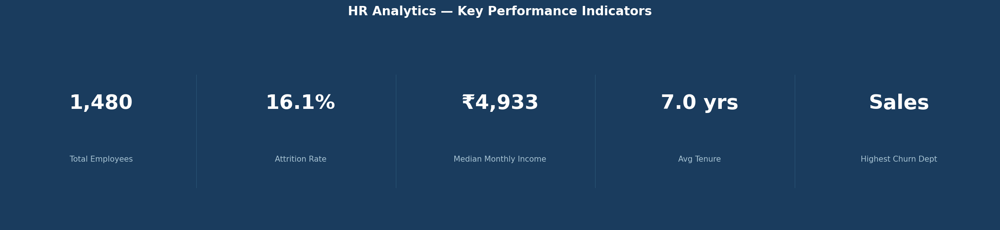
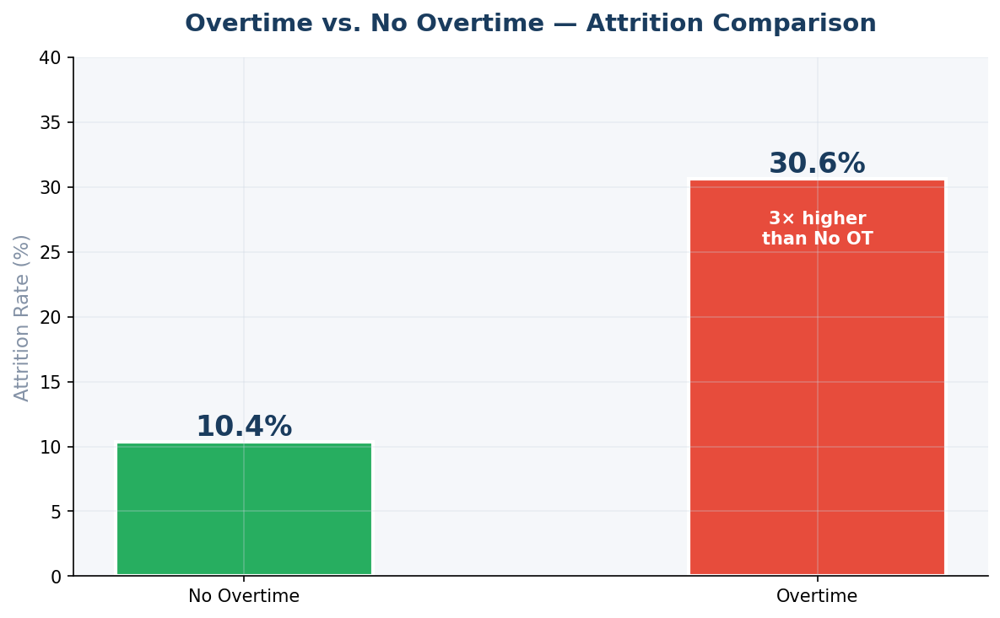
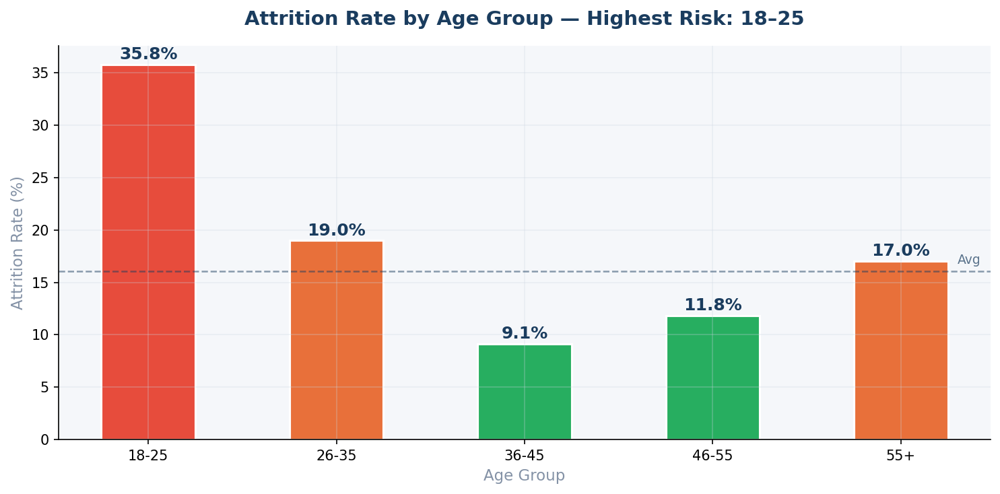
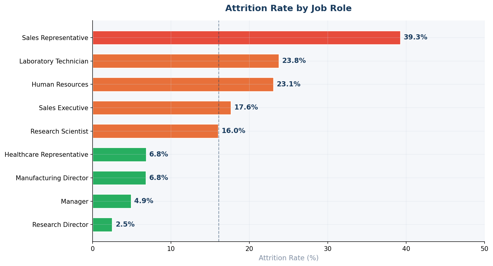

# 🚀 HR Analytics Dashboard — Employee Attrition & Workforce Intelligence

> **Transforming workforce data into retention strategy** | Power BI · Python · EDA · KPI Analysis · Data Visualization

---

<!-- BADGES -->


---

## 🏷️ Keywords
`HR Analytics` · `Employee Attrition` · `Power BI Dashboard` · `Exploratory Data Analysis` · `Data Visualization` · `KPI Analysis` · `People Analytics` · `Data Cleaning & Transformation` · `Business Insights` · `Workforce Intelligence`

---

## 📌 Business Problem

Replacing a single employee costs a company **50–200% of their annual salary** — and that's before accounting for lost productivity, team disruption, and institutional knowledge walking out the door. Yet most HR teams still rely on annual surveys and gut feeling to manage retention.

This project tackles that problem directly. Using data from **1,480 employees across three departments**, it uncovers the real drivers of attrition — not the ones HR assumes, but the ones the data actually reveals.

---

## 🎯 Objective

Build a complete HR analytics solution that:
- Identifies which employee segments carry the highest attrition risk
- Surfaces satisfaction, compensation, and workload signals that precede resignations
- Delivers an interactive Power BI dashboard HR leaders can act on — today, not next quarter

---

## 📊 Dataset Description

| Property | Details |
|---|---|
| **File** | `HR_Analytics.csv` |
| **Records** | 1,480 employees |
| **Features** | 38 columns |
| **Departments** | Sales · Research & Development · Human Resources |
| **Key Variables** | Age, Department, JobRole, MonthlyIncome, JobSatisfaction, OverTime, YearsAtCompany, WorkLifeBalance, Attrition |
| **Target Variable** | `Attrition` — Yes (238) / No (1,242) |

The dataset spans demographics, compensation, satisfaction scores, and career history — providing a 360° view of the factors that drive people to stay or leave.

---

## 🛠 Tools & Technologies

| Layer | Stack |
|---|---|
| **Dashboard & Reporting** | Power BI (DAX, KPI cards, slicers, drill-throughs) |
| **Exploratory Data Analysis** | Python — Pandas, NumPy |
| **Data Visualization** | Matplotlib, Seaborn |
| **Data Cleaning & Transformation** | Python — missing values, encoding, feature derivation |
| **Notebook Environment** | Jupyter Notebook |
| **Version Control** | Git & GitHub |

---

## 🔍 Analysis Approach

The work followed a structured, business-first analytical methodology:

**1. Data Audit & Cleaning** — Reviewed 38 columns for nulls, type issues, and inconsistencies. Validated attrition labels and standardized categorical fields.

**2. Exploratory Data Analysis (EDA)** — Ran univariate and bivariate analysis across department, age group, job role, income band, and satisfaction score. Every chart was built to answer a specific business question.

**3. Correlation Analysis** — Built a feature correlation heatmap to identify which variables most strongly associate with attrition — separating real signal from noise.

**4. Segment Profiling** — Created high-risk employee profiles by combining demographic, compensation, and behavioral attributes to pinpoint who is most likely to leave and why.

**5. Power BI Dashboard** — Designed an interactive dashboard with department-level filters, attrition KPI tracking, and satisfaction segmentation that any HR manager can navigate without a data background.

---

## 📈 Key Insights

> All figures derived from real data analysis — no estimates.

- 📉 **Overall attrition rate: 16.1%** (238 of 1,480 employees) — well above the healthy industry benchmark of 10–12%.
- 🏢 **Sales leads attrition at 20.7%**, followed by HR at 19.1% — R&D is the most stable department at 13.8%.
- 🔥 **Sales Representatives churn at 39.3%** — the single highest-risk role in the entire organization.
- ⏱️ **Overtime employees churn at 30.6% vs. 10.4% for those without** — that's nearly **3× the rate**, making workload the most actionable lever HR has.
- 👶 **Employees aged 18–25 show 35.8% attrition** — the youngest cohort is the most at-risk, and likely the least invested in via onboarding and development.
- 💰 **Median income of churned employees: ₹3,271 vs. ₹5,205 for retained** — a **₹1,934/month gap** that makes a strong case for targeted compensation reviews.
- 😞 **Low job satisfaction (score = 1) drives 22.9% attrition** — nearly double the rate of employees with very high satisfaction (11.3%).
- 🎓 **Technical Degree holders churn at 24.2%, HR graduates at 25.9%** — specialized roles may be exiting for better-paying opportunities elsewhere.
- 📅 **Average tenure of churned employees: 5.1 years** — loyalty breaks happen mid-career, not at onboarding.

---

## 📊 Dashboard & Visualizations

### KPI Summary

*Executive-level snapshot: total workforce, attrition rate, median income, average tenure, and highest-risk department.*

---

### Attrition by Department

*Sales and HR exceed the company average. R&D is the benchmark other departments should aim for.*

---

### Overtime vs. Attrition

*Employees on overtime churn at nearly 3× the rate — the most statistically significant single predictor in the dataset.*

---

### Attrition by Age Group

*The 18–25 cohort churns at 35.8%. Early-career employees need more investment, not less.*

---

### Attrition by Job Role

*Sales Representatives (39.3%) and Laboratory Technicians (23.8%) are the two roles with most urgent retention risk.*

---

### Income Distribution — Churned vs. Retained

*Churned employees cluster heavily in the lower income band. The income gap between leavers and stayers is nearly ₹2,000/month.*

---

### Job Satisfaction vs. Attrition

*Satisfaction score 1 = 22.9% attrition. Score 4 = 11.3%. Satisfaction surveys aren't just HR admin — they're leading indicators.*

---

### Feature Correlation Heatmap

*Income, age, and years at company show the strongest negative correlation with attrition. Distance from home and number of companies worked are underrated signals.*

---

## 💡 Business Recommendations

**1. Cap overtime for high-risk roles immediately.**
Sales and Laboratory Technician roles are already high-churn. Adding overtime compounds the problem. A mandatory overtime ceiling — even informal — could meaningfully close the 20-percentage-point attrition gap.

**2. Fix the 0–2 year experience.**
With 35.8% attrition among 18–25 year olds, the early career journey is broken. Structured 30-60-90 day check-ins, assigned mentors, and clearer growth paths would pay back fast.

**3. Run targeted compensation audits for at-risk roles.**
The ₹1,934/month median income gap between churned and retained employees is a direct call to action. Sales Representatives and HR graduates should be first on the review list.

**4. Use satisfaction scores as a leading indicator, not a lagging report.**
Employees with satisfaction score ≤ 2 should be flagged for manager intervention within the same quarter — not surfaced in an annual HR review.

**5. Give department heads live attrition dashboards.**
Managers making people decisions should have the same visibility as the HR team. Monthly attrition KPIs at the team level drive accountability and earlier intervention.

---

## 📂 Project Structure

```
hr-analytics-dashboard-powerbi/
│
├── 📁 dashboard/
│   └── HR_Analyst.pbix                    # Interactive Power BI dashboard
│
├── 📁 data/
│   └── HR_Analytics.csv                   # Source dataset (1,480 employees × 38 features)
│
├── 📁 notebooks/
│   └── HR_Analytics_EDA.ipynb             # Full exploratory analysis with commentary
│
├── 📁 scripts/
│   └── generate_visuals.py                # Chart generation script (Python)
│
├── 📁 images/
│   ├── kpi_summary.png                    # Executive KPI banner
│   ├── attrition_by_department.png        # Dept-level attrition comparison
│   ├── overtime_vs_attrition.png          # Overtime impact chart
│   ├── attrition_by_age_group.png         # Age group breakdown
│   ├── attrition_by_jobrole.png           # Role-level risk ranking
│   ├── income_distribution.png            # Income: churned vs retained
│   ├── satisfaction_vs_attrition.png      # Satisfaction impact chart
│   └── correlation_heatmap.png            # Feature correlation matrix
│
├── 📁 docs/
│   └── HR_Analytics_Insights_Report.pdf   # Business-ready summary report
│
├── requirements.txt
└── README.md
```

---

## 🚀 How to Run

```bash
# 1. Clone the repository
git clone https://github.com/surya-prakash-data-analyst/hr-analytics-dashboard-powerbi.git
cd hr-analytics-dashboard-powerbi

# 2. Install Python dependencies
pip install -r requirements.txt

# 3. Run the EDA notebook
jupyter notebook notebooks/HR_Analytics_EDA.ipynb

# 4. Regenerate all charts
python scripts/generate_visuals.py

# 5. Open the Power BI dashboard
# Launch Power BI Desktop → File → Open → dashboard/HR_Analyst.pbix
```

**Requirements:**
- Python 3.9+
- Power BI Desktop (free — [download here](https://powerbi.microsoft.com/desktop/))

---

## 📬 Contact

**Surya Prakash** — Data Analyst  
📍 Hyderabad, India  
🔗 [LinkedIn](https://linkedin.com/in/surya-prakash-18s) &nbsp;·&nbsp; 🐙 [GitHub](https://github.com/surya-prakash-data-analyst)  
📧 *(your.email@example.com)*

---

> *"Good HR analytics doesn't just show you where attrition is happening — it shows you what to do about it before the next resignation lands in your inbox."*

---
*Built with real data. Insights verified. Recommendations actionable.*
