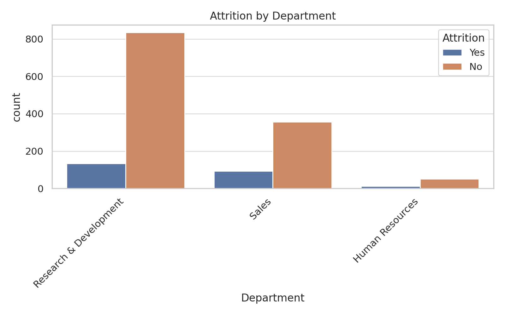
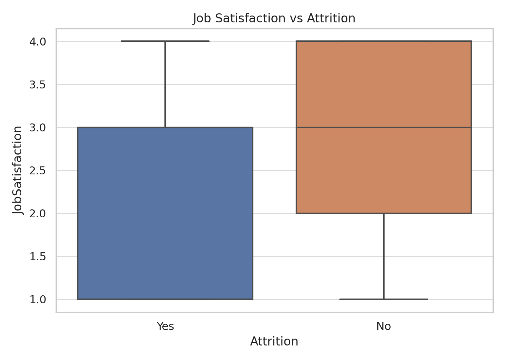
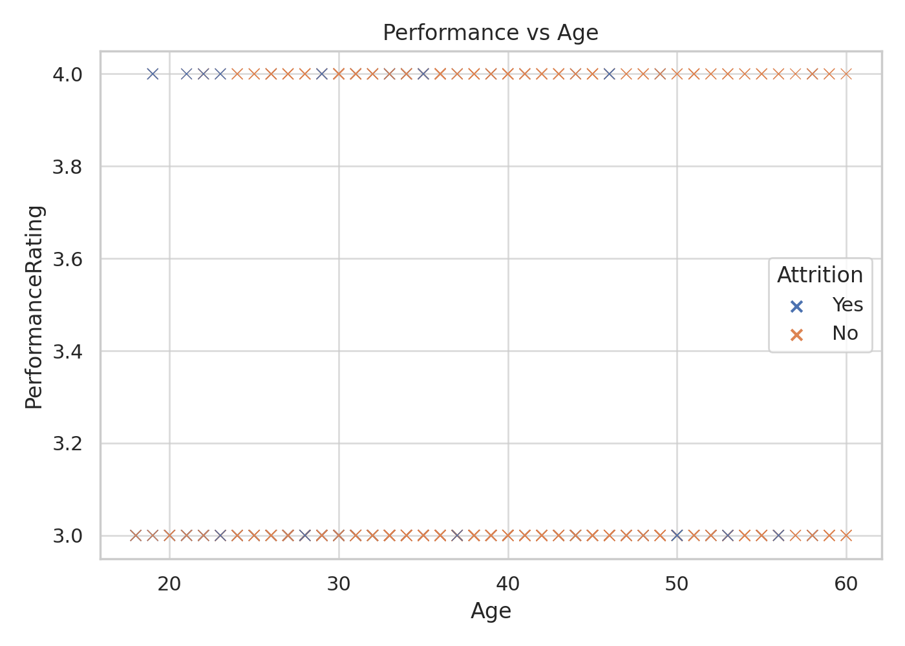
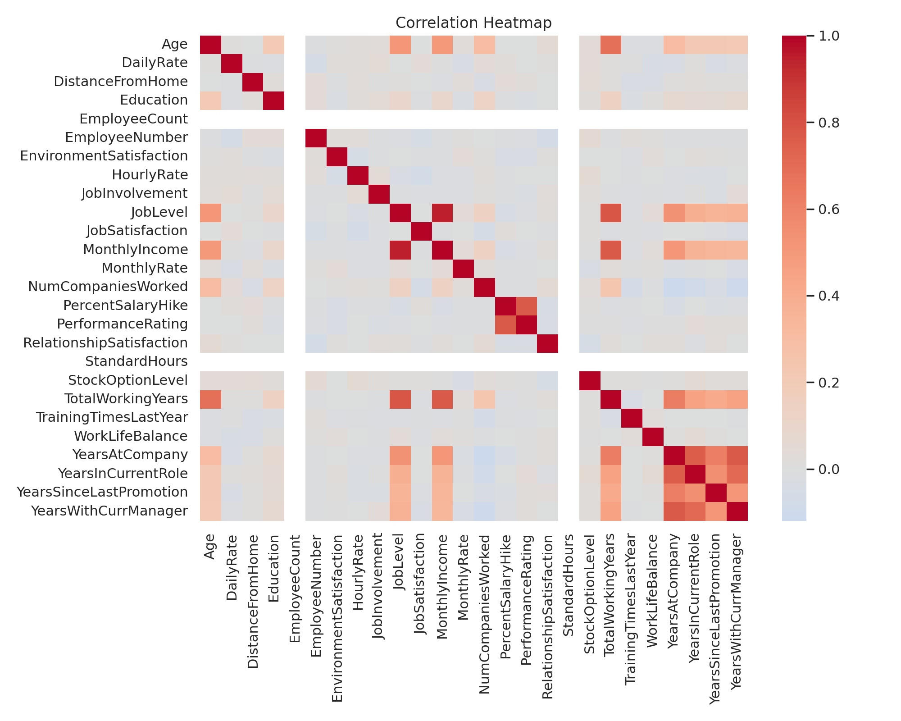
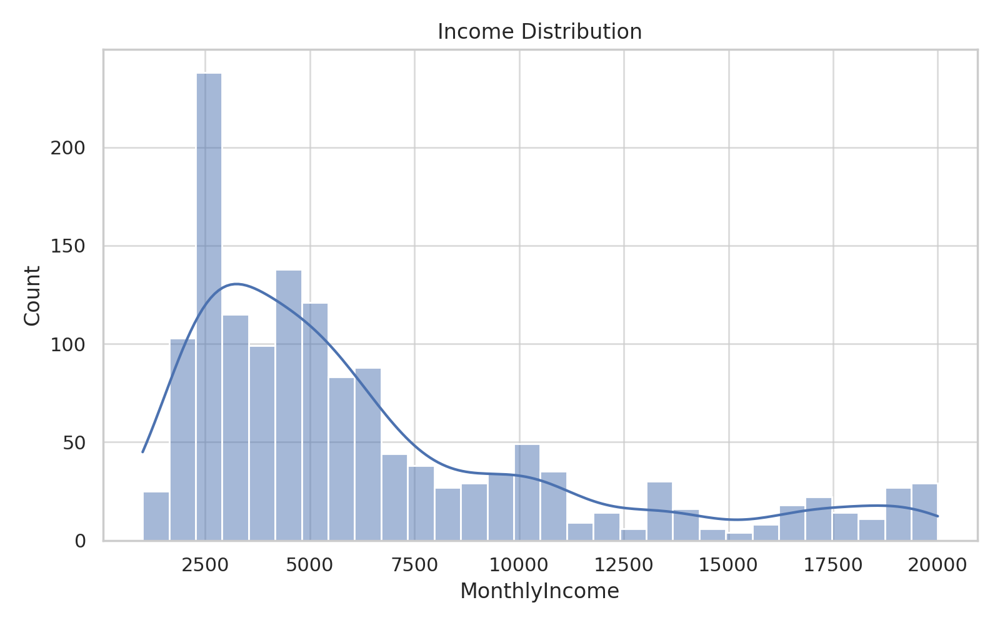

# HR Analytics Dashboard – Employee Performance & Retention Insights

**Author:** Surya Prakash  
**Created:** 2025-11-12  

## Table of Contents
1. Overview
2. Business Problem
3. Dataset
4. Tools & Technologies
5. Project Structure
6. Key KPIs
7. Visual Insights
8. How to Run
9. Recommendations
10. Contact

## Overview
Data-driven HR insights to reduce attrition and improve performance.

## Dataset
- File: data/HR_Analytics.csv
- Shape: (1480, 38)
- Sample columns: EmpID, Age, AgeGroup, Attrition, BusinessTravel, DailyRate, Department, DistanceFromHome

## Key KPIs
- Attrition Rate: 0.1608
- Average Tenure: 7.01
- Median Income: 4933.0

## Visual Insights

- 

- 

- 

- 

- 

## How to Run
```
pip install -r requirements.txt
jupyter notebook notebooks/HR_Analytics_Exploration.ipynb
python scripts/generate_hr_insights.py
```
